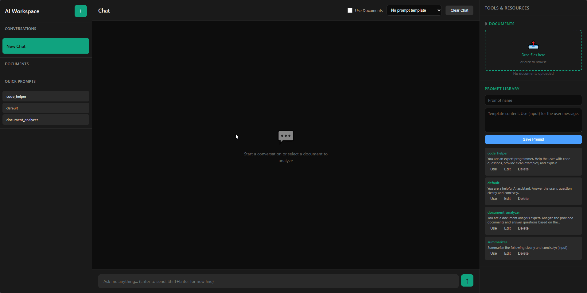
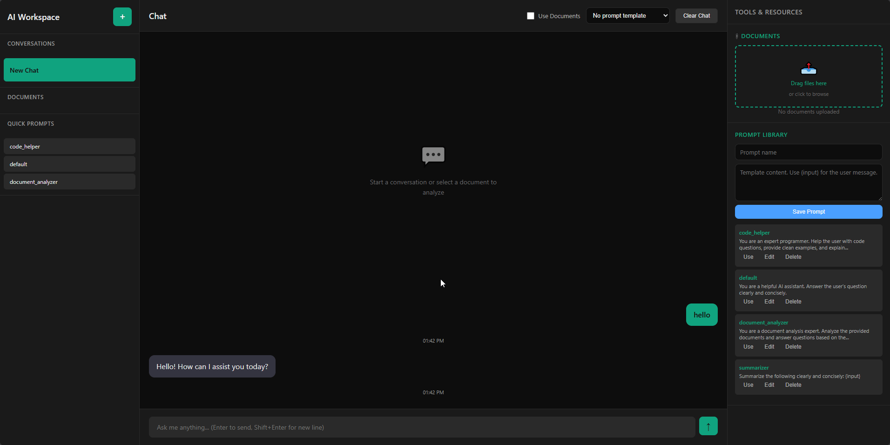
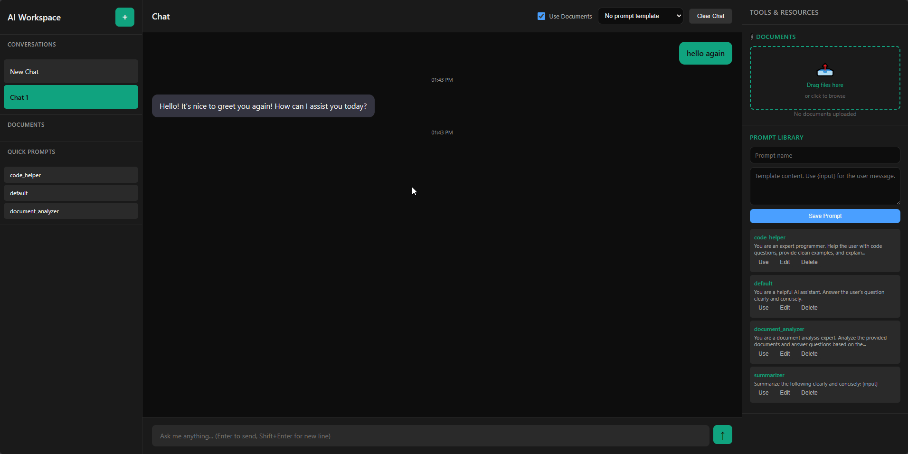
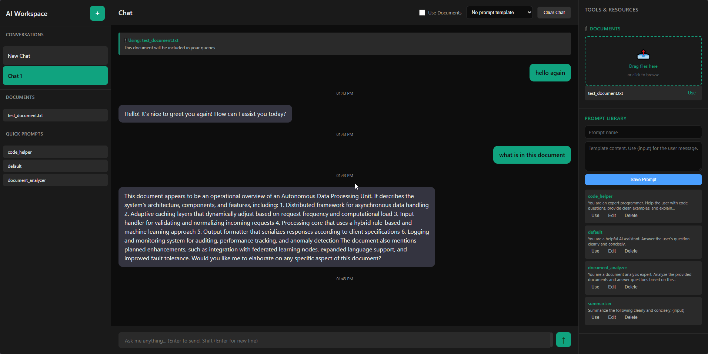
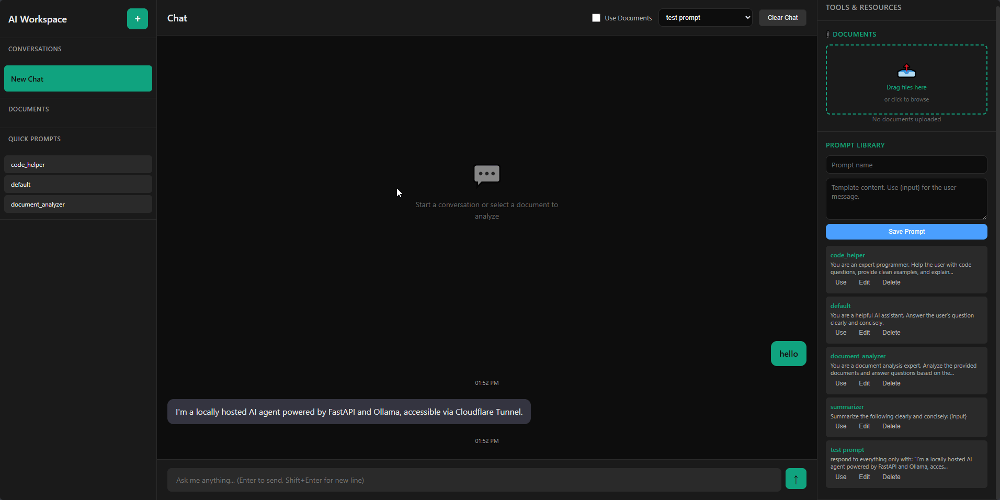

# AI Document Agent

**A local-first AI workspace — chat with your documents, no cloud required.**

Upload PDF, DOCX, or TXT files and ask questions with optional RAG context. Built with FastAPI, Ollama, and FAISS. A private, self-hosted alternative to ChatGPT with your own files.

<p align="center">
  
  
  
  
  
  
</p>

---

## Live Demo Overview

AI Document Agent is a full AI workspace that runs entirely on your machine:

| Capability | Description |
|------------|-------------|
| **Chat** | Conversational AI powered by local Ollama models |
| **Document RAG** | Upload files, embed chunks, retrieve relevant context at query time |
| **Prompt library** | Save, edit, and reuse templates with `{input}` variables |
| **Session memory** | Multiple chats with per-session history and settings |

**Quick start:**

```bash
python launcher.py
```

Open **http://localhost:8000** — or use the auto-generated Cloudflare tunnel URL for a public demo.

---

## Feature Demo

> GIFs live in `images/`. 

### Basic Chat

Simple conversation with a local LLM — fast, private, and fully offline-capable.



---

### Session Memory

Create new chats and switch between sessions. Conversation history persists per session during runtime.



---

### Document Q&A (RAG)

Upload PDF, DOCX, or TXT files and ask questions about their content. Documents are chunked, embedded, and indexed in FAISS.



---

### Toggle Document Usage

Enable or disable document context per session. Compare pure LLM answers vs RAG-enhanced responses with one click.



---

### Prompt Library

Create reusable prompt templates and apply them from the chat header. Use `{input}` as a placeholder for the user's message.


---

### Prompt Management

Edit and delete saved prompts from the library panel. Templates sync via the REST API (`GET/POST/PUT/DELETE /prompts`).



---

## Why this project

This project demonstrates a full local AI system combining:

- **Retrieval-Augmented Generation (RAG)** — semantic search over uploaded documents
- **Local LLM inference** — no cloud API dependency for chat or embeddings
- **Document understanding pipeline** — PDF, DOCX, and TXT extraction with chunking and indexing
- **Real-time chat UI** — sessions, prompt library, and optional document mode
- **Production-style API architecture** — modular services, dependency injection, OpenAPI docs

Built as a portfolio-ready example of how to ship a private, self-hosted AI knowledge assistant.

---

## Architecture

```
Frontend (Vanilla JS Dashboard)
        │
        ▼
FastAPI Backend  (/chat · /documents · /prompts · /health)
        │
        ├──► Memory + Prompt Services
        │
        ▼
RAG Service  (chunk → embed → retrieve)
        │
        ▼
FAISS Vector Store  (in-memory, top-k similarity search)
        │
        ▼
Ollama  (chat model + nomic-embed-text embeddings)
```

**Request flow (chat with documents):**

1. User sends a message from the dashboard
2. FastAPI optionally queries FAISS for top-k relevant chunks
3. Context + history + prompt template are assembled
4. Ollama generates a response
5. Reply is stored in session memory and returned to the UI

---

## Tech Stack

| Layer | Technology |
|-------|------------|
| Backend | FastAPI (Python) |
| LLM | Ollama (`llama3.2`, etc.) |
| Embeddings | `nomic-embed-text` + `sentence-transformers` fallback |
| Vector DB | FAISS (in-memory) |
| Document parsing | pypdf, python-docx |
| Frontend | Vanilla JS (chat UI dashboard) |
| Deployment | Cloudflare Tunnel + LAN support (`0.0.0.0` binding) |

---

## Setup

### Prerequisites

- Python 3.11+ (3.14 supported)
- [Ollama](https://ollama.com/) running locally (default `http://localhost:11434`)
- A chat model, e.g. `llama3.2`
- An embedding model for RAG, e.g. `nomic-embed-text`
- [cloudflared](https://developers.cloudflare.com/cloudflare-one/connections/connect-networks/downloads/) (optional, for `launcher.py` public tunnel)

```bash
ollama pull llama3.2
ollama pull nomic-embed-text
```

### Install

1. Create and activate a virtual environment.
2. Install dependencies:

```bash
python -m pip install -r requirements.txt
```

3. (Optional) Configure environment variables or a `.env` file in the project root.

### Run

**Full stack (recommended):**

```bash
python launcher.py
```

Starts the API, waits for `/health`, launches a Cloudflare quick tunnel, copies the public URL to clipboard, and opens the dashboard.

**Local API only:**

```bash
python -m uvicorn app.main:app --host 0.0.0.0 --port 8000
```

**Interactive CLI (legacy agent):**

```bash
python main.py
```

**API mode via root entrypoint:**

```bash
python main.py --api
```

### Configuration

| Variable | Default | Description |
|----------|---------|-------------|
| `OLLAMA_BASE_URL` | `http://localhost:11434` | Ollama server URL |
| `OLLAMA_DEFAULT_MODEL` | `llama3.2` | Default chat model |
| `OLLAMA_EMBEDDING_MODEL` | `nomic-embed-text` | Embedding model for RAG |
| `EMBEDDING_FALLBACK_MODEL` | `all-MiniLM-L6-v2` | Fallback if Ollama embeddings fail |
| `RAG_CHUNK_SIZE` | `800` | Characters per chunk |
| `RAG_CHUNK_OVERLAP` | `150` | Overlap between chunks |
| `RAG_TOP_K` | `4` | Retrieved chunks per query |
| `PORT` | `8000` | Server port (`launcher.py`) |
| `CLOUDFLARED_PATH` | auto-detect | Path to `cloudflared` executable |

**Remote Ollama (LAN)** — Windows PowerShell:

```powershell
$env:OLLAMA_BASE_URL = "http://192.168.1.50:11434"
python launcher.py
```

Or in `.env`:

```text
OLLAMA_BASE_URL=http://192.168.1.50:11434
```

---

## API Reference

Interactive docs: [http://localhost:8000/docs](http://localhost:8000/docs)

| Method | Path | Description |
|--------|------|-------------|
| `GET` | `/` | Web dashboard |
| `GET` | `/health` | Health check + Ollama status |
| `GET` | `/models` | List available Ollama models |
| `POST` | `/chat` | Chat with optional RAG and prompt template |
| `POST` | `/documents/upload` | Upload and index `.txt`, `.pdf`, `.docx` |
| `GET` | `/documents` | List uploaded documents |
| `DELETE` | `/documents/{doc_id}` | Delete a document |
| `DELETE` | `/documents` | Clear all documents |
| `GET` | `/prompts` | List prompt templates |
| `POST` | `/prompts` | Create a prompt |
| `GET` | `/prompts/{prompt_id}` | Get one prompt |
| `PUT` | `/prompts/{prompt_id}` | Update a prompt |
| `DELETE` | `/prompts/{prompt_id}` | Delete a prompt |
| `GET` | `/sessions/{session_id}/history` | Session chat history |
| `DELETE` | `/sessions/{session_id}/history` | Clear session history |

### Chat request example

```json
{
  "prompt": "What is the main topic of my upload?",
  "session_id": "default",
  "model": "llama3.2",
  "use_documents": true,
  "prompt_id": "prompt_3"
}
```

- `use_documents: true` — retrieve relevant chunks from the vector store (default)
- `use_documents: false` — pure LLM chat, no document context
- `prompt_id` — optional; merges a saved template (`{input}` replaced with `prompt`)

---

## How it works

### Document upload flow

1. File is saved temporarily on disk
2. Text is extracted via unified parser (`extract_text`) — PDF (pypdf), DOCX (python-docx), TXT
3. Full text is stored in `DocumentService`
4. Text is chunked, embedded, and indexed in FAISS via `RAGService`
5. On chat (when `use_documents` is true), top-k similar chunks are injected into the LLM prompt

### Dashboard

The frontend at `/` supports:

- Multi-session chat
- **Use Documents** toggle (per session)
- Prompt template dropdown
- Prompt library (create, edit, delete)
- Drag-and-drop upload for PDF, DOCX, TXT

The API base URL is resolved automatically from `window.location.origin` (works on localhost, LAN, and Cloudflare tunnel).

### Embedding fallback

RAG prefers Ollama embeddings (`nomic-embed-text`). If Ollama embeddings are unavailable, the system falls back to `sentence-transformers` (`all-MiniLM-L6-v2`):

```bash
ollama pull nomic-embed-text
```

---

## Project structure

```
AI-Document-Agent/
├── app/                          # FastAPI application (main product)
│   ├── main.py                   # App factory + route registration
│   ├── api/
│   │   └── routes.py             # REST endpoints
│   ├── models/
│   │   └── schemas.py            # Pydantic request/response models
│   ├── core/
│   │   ├── config.py             # Settings (Ollama, RAG, etc.)
│   │   └── exceptions.py         # API error types
│   ├── clients/
│   │   └── ollama_client.py      # Ollama HTTP client
│   ├── services/
│   │   ├── document_service.py   # Document metadata storage
│   │   ├── prompt_service.py     # Prompt library CRUD
│   │   ├── memory_service.py     # Session chat history
│   │   ├── llm_service.py        # Chat + model listing
│   │   └── rag/                  # RAG pipeline
│   │       ├── ingestion.py      # PDF / DOCX / TXT extraction
│   │       ├── chunking.py       # Text chunking
│   │       ├── embeddings.py     # Ollama + fallback embeddings
│   │       ├── vector_store.py   # FAISS index
│   │       └── service.py        # RAGService orchestration
│   └── frontend/
│       └── index.html            # Dashboard UI
├── ai_agent/                     # Interactive CLI agent (python main.py)
├── scripts/                      # Dev & maintenance utilities
│   ├── verify_system.py          # Smoke-test services + routes
│   └── diagnostics_ollama.py     # Ollama connectivity probe
├── tests/                        # API tests + debug route scripts
├── data/                         # Sample documents for CLI
├── images/                       # Feature demo GIFs (README showcase)
├── launcher.py                   # One-command startup (API + tunnel)
├── main.py                       # CLI / API entrypoint
├── .env.example                  # Example environment variables
└── requirements.txt
```

---

## Development notes

- FastAPI binds to `0.0.0.0` for LAN access
- RAG vector store is in-memory (resets on server restart)
- Upload debug logs appear in the server console: `[UPLOAD] filename`, `extracted chars`, `rag chunks indexed`
- Utility scripts: `python scripts/verify_system.py`, `python scripts/diagnostics_ollama.py`

### Future improvements

- **Persistent FAISS index storage** — save/load embeddings to disk so document memory survives restarts
- Optional ChromaDB backend as an alternative vector store

---

## License

See repository license file.
